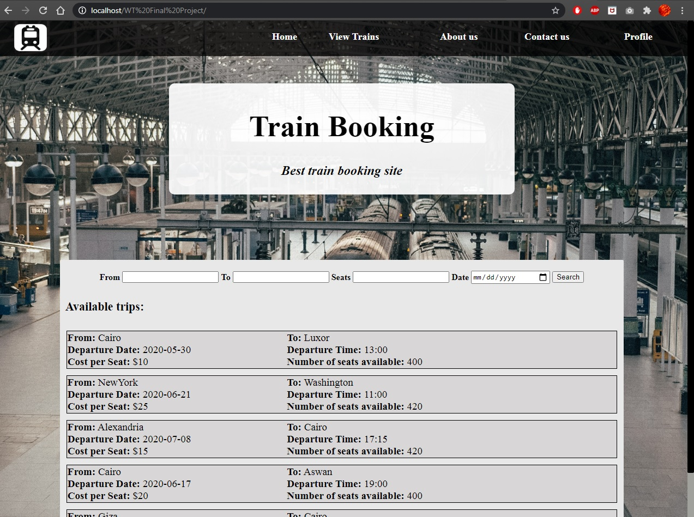
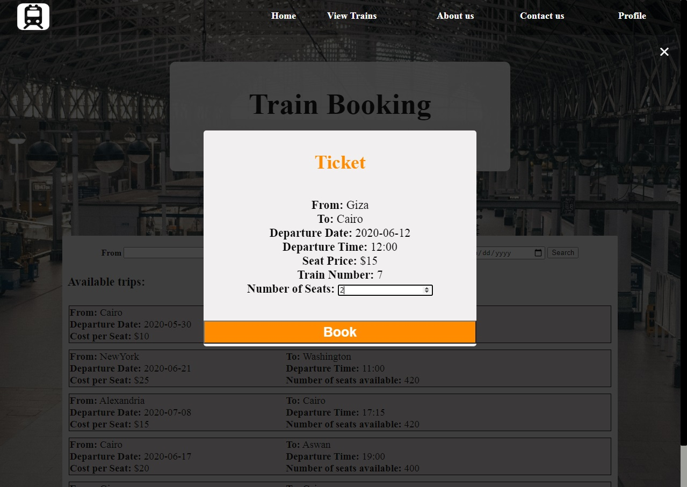
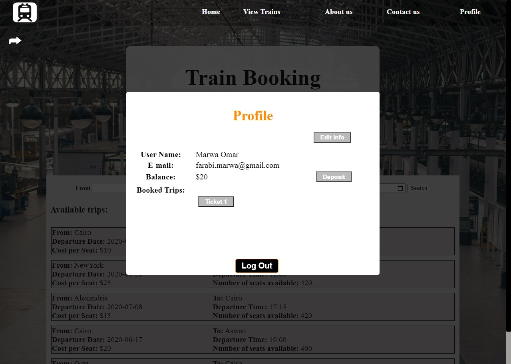
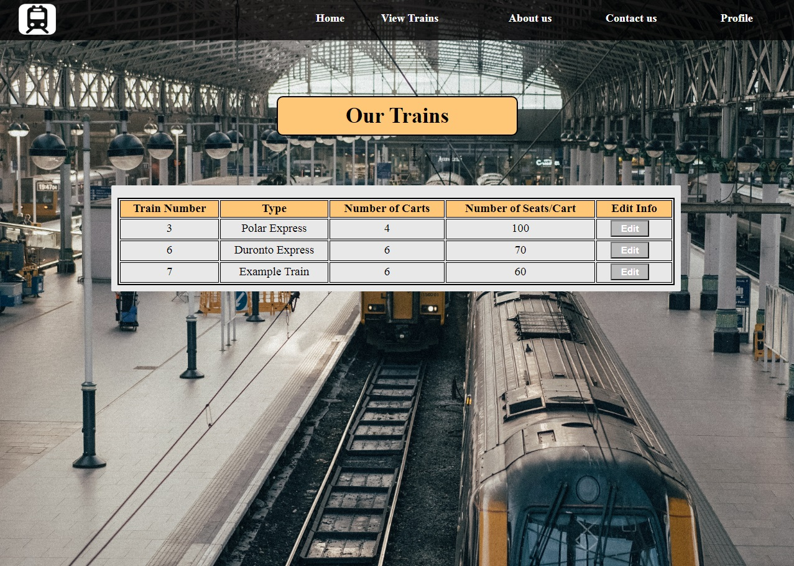

# Train Booking Website
A website in which the customer can search for a train trip from one city to another then book and pay for any number of seats they would like in that trip. 
<h3>Admin Account</h3>
<ul> 
  <li>Email: admin@gmail.com</li>
  <li>Password: admin01</li>
</ul>
<h3>Screenshots</h3>
  
  
  
  
 <h4>More screenshots in the documentation</h4>
